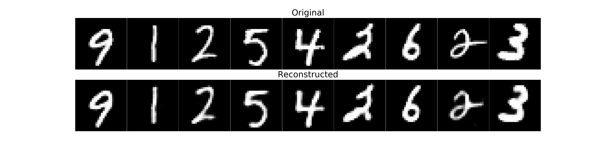
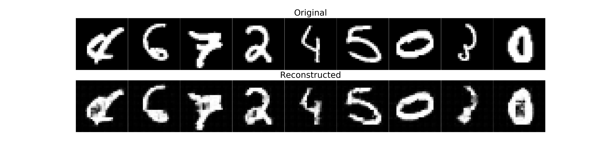
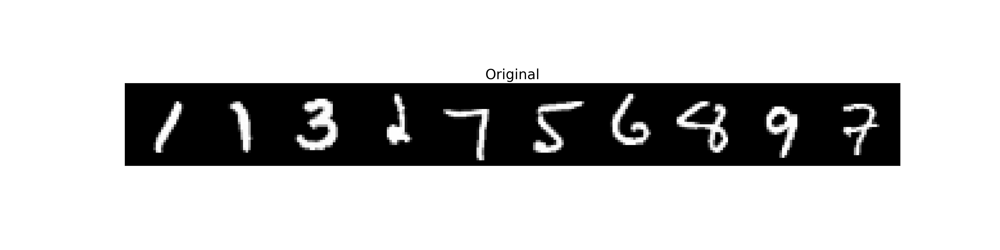
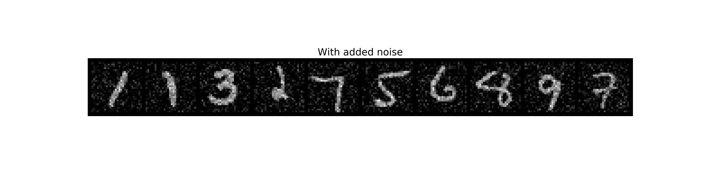
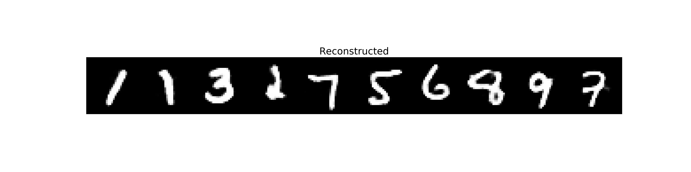
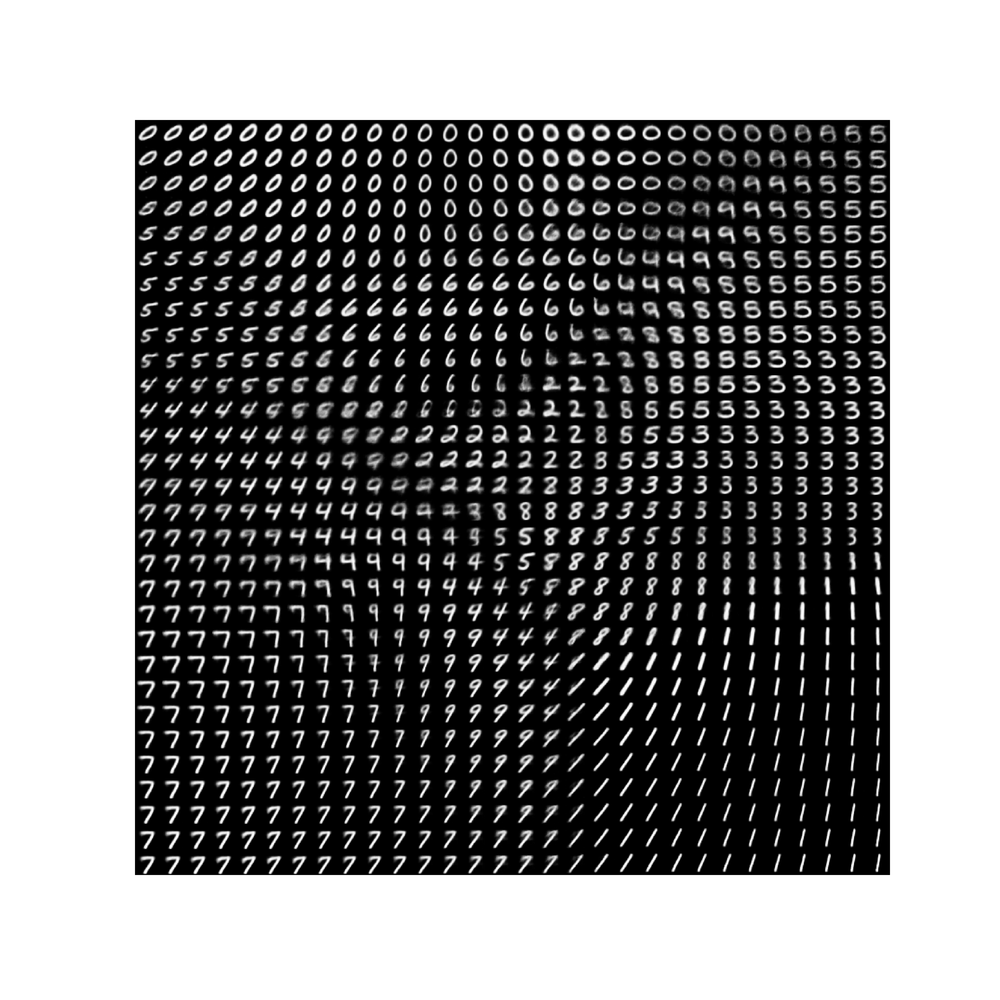

# AEs

## Simple_AE.ipynb
The file consist of two models - one made with convolutional layers and the other one is linear with ReLU activations.

Linear:

Conv:

## Denoising_AE.ipynb
It works the same as linear but noisy inputs are compared to images without noise

## VAE.ipynb
Variational Autoencoder 
Encoder and decoder layers are linear. Generated images by this VAE are shown below

